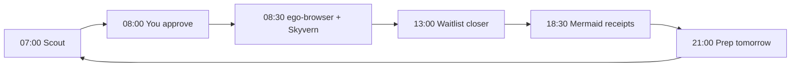
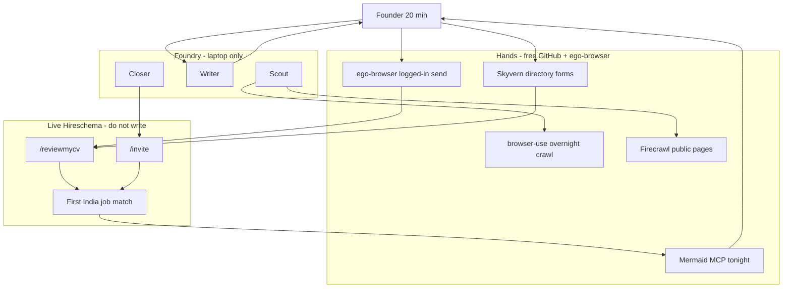
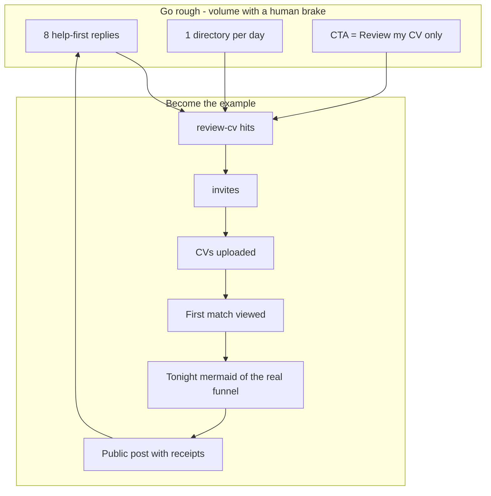

# Foundry Daily OS

Internal only. Runs on the laptop. Never touches production Hireschema.

Hireschema is a candidate product: Indian job-seekers find India jobs (match → apply / warm intro). Foundry’s only job is to put that product in front of job-seekers and get them to a **first useful match**.

The CTA is always `/reviewmycv` or `/invite`. Never “AI recruiting platform.”

---

## North star (daily)

> Did 10 more Indian job-seekers see a real job match today?

Vanity (ignore as goals): posts published, directories submitted, “impressions.”

---

## Clock (IST)

| Time | Slot | Who | Output |
|---|---|---|---|
| 07:00 | Scout | browser-use + Firecrawl + gpt-researcher | 20 threads of people *looking for jobs* |
| 08:00 | Approve | You (20 min, non-negotiable) | 8 approved replies + 1 public post draft |
| 08:30 | Distributor | ego-browser + Skyvern | Replies posted; 1 directory form submitted |
| 13:00 | Closer | You + waitlist admin | Invites approved; nudge CV → first match |
| 18:30 | Receipts | Mermaid MCP + you | Today’s funnel diagram + public scoreboard post |
| 21:00 | Prep | LangGraph / notes | Tomorrow’s ICP + 3 communities to hit |

If any slot exceeds its time box, cut agents. The founder approval window is the product.

---

## Hands vs brains

| Job | Free GitHub / local | Why |
|---|---|---|
| Logged-in browsing (Reddit, LinkedIn, X, directories) | **ego-browser** (already on this machine) | Isolated task space, reuses your login, does not steal your tabs |
| Overnight public crawl | [browser-use](https://github.com/browser-use/browser-use) | Best open browser agent for “find pages like this” |
| Directory / form write | [Skyvern](https://github.com/Skyvern-AI/Skyvern) | Built for filling forms |
| Public page extract | Firecrawl skills already on disk | No login required |
| Research briefs | [gpt-researcher](https://github.com/assafelovic/gpt-researcher) | “Where are 2–8 YOE Indian SWE looking this week?” |
| Orchestration | LangGraph (already in `api/`) copied locally — do not import prod | Same loop pattern, different database (SQLite) |
| Tonight’s diagram | Mermaid MCP (`user-mermaid`) | The public receipt |

Live app stays sacred: Foundry may **link to** `/reviewmycv` and `/invite`. It may not write production Postgres, use candidate Gmail tokens, SendGrid for cold mail, or MSG91 for unsolicited WhatsApp.

---

## Go-rough marketing (volume with a human brake)

Rough means **high volume of help-first distribution**, not spam.

Every day, no exceptions:

1. **8 replies** in places job-seekers already are (Reddit `r/developersIndia`, LinkedIn #OpenToWork India, X India tech). Help first. One link. You click send.
2. **1 directory** via Skyvern (AI/SaaS/job-tool lists) until 50 are live.
3. **1 public receipt** — today’s mermaid funnel + the four numbers below.
4. **CTA = Review my CV** only.

30-day public experiment (this is how you become the case study):

> “I ran GTM with agents for 30 days to get Indians their first job match. Here is the machine. Here are the numbers. Here is the diagram.”

You are not “an AI startup that uses AI.” You are the founder who **publishes the agent loop**. That is the marketing. Hireschema the product is the proof that the loop works (people see jobs).

Forbidden: WhatsApp group blasts, LinkedIn cookie scraping, SendGrid cold email, fake comments, recruiter outbound.

---

## Four numbers (post these raw)

1. `/reviewmycv` hits
2. Invite requests
3. Signups who uploaded a CV
4. **First useful match viewed**

If (4) is not moving, stop posting and fix Scout targeting.

ICP for 90 days: 2–8 YOE software engineers, Bangalore / Hyderabad / NCR / Pune, actively looking.

---

## Diagrams

Mermaid MCP is connected in Cursor as `mermaid` (`user-mermaid`). Tonight’s 18:30 slot should call `generate` on the **real** day’s numbers. Until Puppeteer Chrome is installed locally, source lives here and SVGs can be rendered via Kroki.

### Daily clock

### Hands vs live app

### Case-study loop

